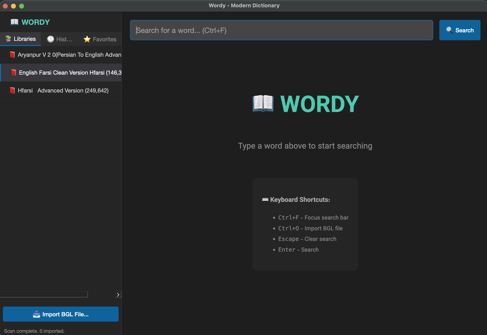

<p align="center">
  
</p>

<h1 align="center">Wordy</h1>

<p align="center">
  <strong>A Modern Dictionary Application for Persian & English</strong>
</p>

<p align="center">
  <a href="#features">Features</a> •
  <a href="#installation">Installation</a> •
  <a href="#usage">Usage</a> •
  <a href="#building">Building</a> •
  <a href="#license">License</a>
</p>

---

## ✨ Features

- 📚 **BGL Dictionary Support** - Import Babylon dictionary files (.bgl)
- 🔍 **Fast Search** - Instant search with SQLite backend
- 🕐 **Search History** - Track your last 100 searches
- ⭐ **Favorites** - Bookmark words for quick access
- 🎨 **Modern Dark UI** - VS Code-inspired design
- 🔤 **Vazir Font** - Optimized for Persian text
- ⌨️ **Keyboard Shortcuts** - Power user friendly

## 📸 Screenshots

<!-- Add your screenshots here -->


## 🚀 Installation

### Prerequisites
- Python 3.10+
- [uv](https://github.com/astral-sh/uv) (recommended) or pip

### From Source

```bash
# Clone the repository
git clone https://github.com/am00gOrilla/wordy.git
cd wordy

# Install dependencies with uv
uv sync

# Run the app
uv run python main.py
```


## 📖 Usage

### Adding Dictionaries

1. **Auto-import**: Place `.bgl` files in the `sources/` folder
2. **Manual import**: Press `Ctrl+O` or click "Import BGL File..."

### Keyboard Shortcuts

| Shortcut | Action |
|----------|--------|
| `Ctrl+F` | Focus search bar |
| `Ctrl+O` | Import BGL file |
| `Escape` | Clear search |
| `Enter` | Search |

### Sidebar Tabs

- **📚 Libraries** - Switch between dictionaries
- **🕐 History** - View and re-search past queries
- **⭐ Favorites** - Access bookmarked words

## 🔧 Building

Generate standalone executables for distribution:

```bash
# Install build dependencies
pip install pyinstaller pillow

# Build for current platform
python build.py

# Create installer scripts (Windows/Linux)
python build.py --scripts
```

### Output Locations
- **Windows**: `dist/Wordy.exe`
- **macOS**: `dist/Wordy.app`
- **Linux**: `dist/Wordy`

## 📁 Project Structure

```
wordy/
├── main.py              # Application entry point
├── dictionary_manager.py # Database & BGL import logic
├── styles.qss           # Qt stylesheet (dark theme)
├── build.py             # Build script for packaging
├── icon.png             # Application icon
├── sources/             # Place BGL files here
└── dictionaries.db      # SQLite database (auto-created)
```

## 🛠️ Tech Stack

- **Python 3.10+**
- **PyQt6** - GUI framework
- **PyQt6-WebEngine** - Rich HTML rendering
- **PyGlossary** - BGL file parsing
- **SQLite** - Fast local database

## 📜 License

This project is licensed under the MIT License - see the [LICENSE](LICENSE) file for details.

## 🙏 Acknowledgments

- [PyGlossary](https://github.com/ilius/pyglossary) for dictionary format support
- [Vazirmatn](https://github.com/rastikerdar/vazirmatn) Persian font
- Persian dictionary contributors

---

<p align="center">
  Made with ❤️ for language learners
</p>
